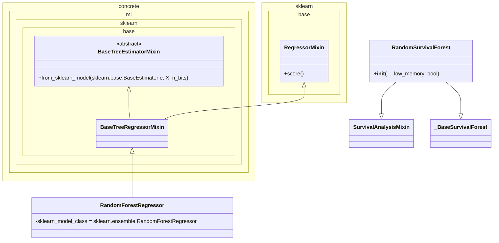

```mermaid
classDiagram
   namespace sklearn.base {
    class RegressorMixin
    }

    namespace concrete.ml.sklearn.base {
    class BaseTreeEstimatorMixin
    class BaseTreeRegressorMixin
    }

    RandomSurvivalForest --|> SurvivalAnalysisMixin
    RandomSurvivalForest --|> _BaseSurvivalForest
    BaseTreeRegressorMixin <|-- RandomForestRegressor
    BaseTreeEstimatorMixin <|-- BaseTreeRegressorMixin
    RegressorMixin <|-- BaseTreeRegressorMixin

    class RandomForestRegressor{
      -sklearn_model_class = sklearn.ensemble.RandomForestRegressor

    }

    class RegressorMixin {
        +score()
    }

   class BaseTreeEstimatorMixin{
     <<abstract>> 
      +from_sklearn_model(sklearn.base.BaseEstimator e, X, n_bits)

    }

    class RandomSurvivalForest{
      +__init__(..., low_memory: bool)

    }
```